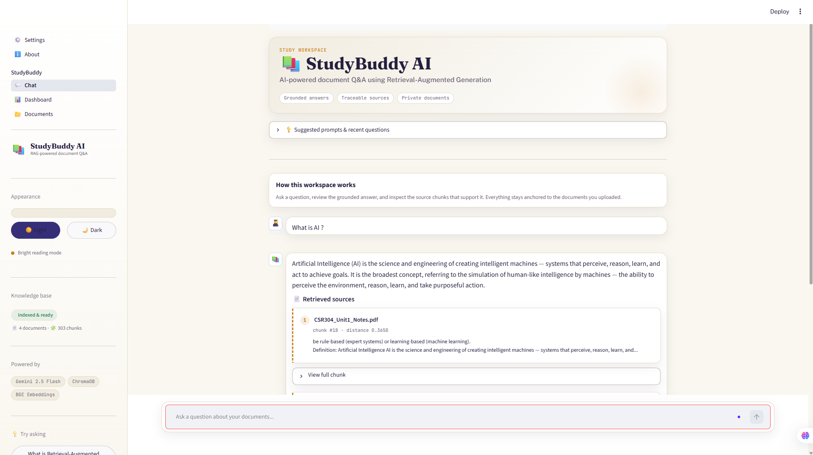
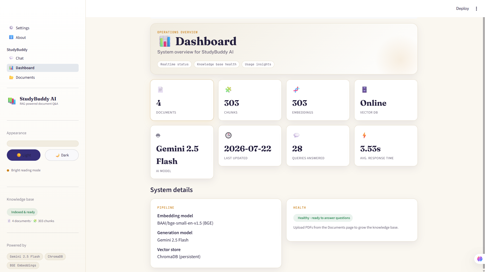
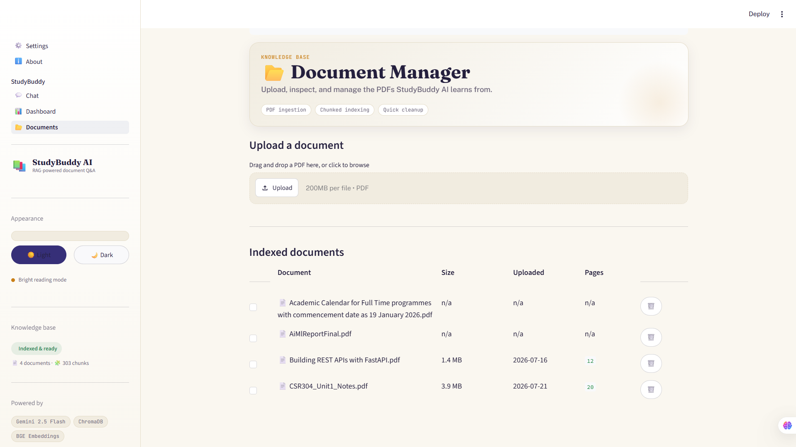
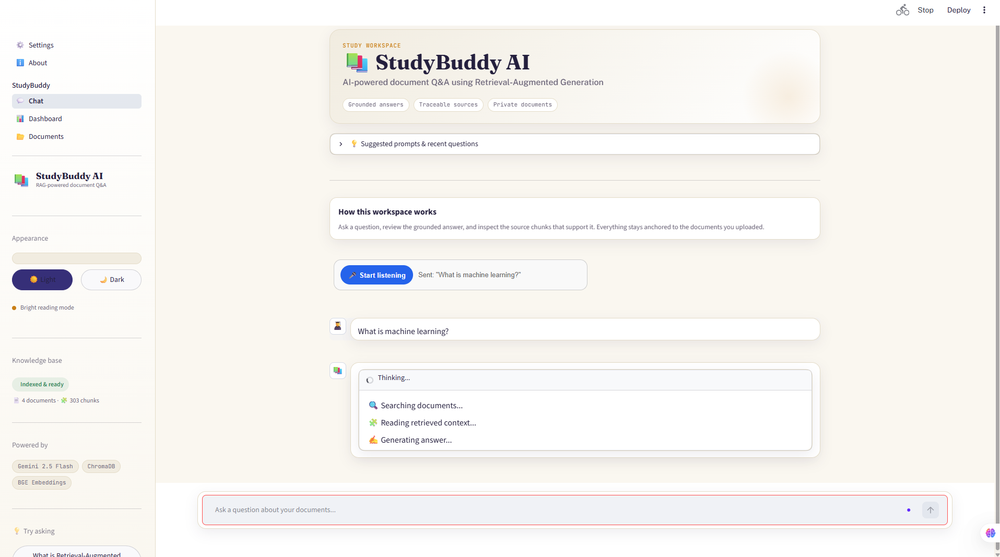
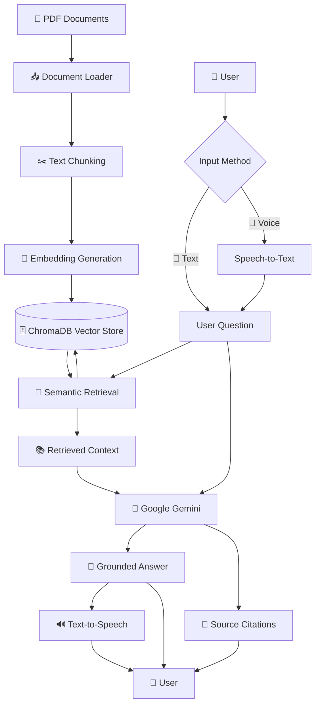

# 📚 StudyBuddy AI — Intelligent Document Q&A with RAG

<p align="center">
  <strong>Ask questions. Get grounded answers. Explore your documents intelligently.</strong>
</p>

<p align="center">
  A modern Retrieval-Augmented Generation (RAG) application that lets users upload PDF documents, ask questions using text or voice, and receive context-aware answers grounded in the uploaded knowledge base with transparent source citations.
</p>

<p align="center">


</p>

---

## 🌟 Overview

**StudyBuddy AI** is an intelligent document question-answering system built using **Retrieval-Augmented Generation (RAG)**. It combines semantic document retrieval with Google Gemini to provide answers grounded in the user's uploaded PDF documents instead of relying solely on the LLM's internal knowledge.

Users can upload multiple documents, ask questions in natural language or through **voice assistance**, and receive answers supported by retrieved document chunks and source metadata.

> 🎯 **Core Goal:** Reduce LLM hallucination by grounding every answer in relevant information retrieved from the user's focused document corpus.

---

## 🎓 Project Information

| Field                | Details                                      |
| -------------------- | -------------------------------------------- |
| 📌 Project           | Document Q&A — RAG over a Focused Corpus     |
| 🧩 Problem Statement | I2 — Document Q&A: RAG over a Focused Corpus |
| 📚 Segment           | Foundations of Applied Machine Learning      |
| 👨‍💻 Author         | Rohit Sharma                                 |
| 🎓 Program           | B.Tech AI & Data Engineering                 |
| 🏫 University        | Lovely Professional University               |
| 💼 Internship        | Futurense Technologies Internship Program    |

---

# 🚀 Key Features

## 📄 Multi-Document PDF Ingestion

* Upload multiple PDF documents through the Streamlit interface.
* Automatic text extraction using `pypdf`.
* Duplicate-file detection.
* Incremental document addition and removal.
* Persistent local knowledge base.

---

## 🧠 Retrieval-Augmented Generation

StudyBuddy AI follows a RAG architecture to retrieve relevant information before generating an answer.

Instead of asking the LLM to answer directly, the system:

1. Receives the user's question.
2. Searches the vector database.
3. Retrieves the most relevant document chunks.
4. Provides the retrieved context to Google Gemini.
5. Generates a grounded answer.

This approach helps reduce hallucinations and keeps answers connected to the uploaded documents.

---

## 🎤 Voice Assistance

Users can interact with StudyBuddy AI using voice input.

The voice pipeline supports:

* 🎙️ Speech-to-Text
* 🌐 Browser-based speech recognition
* 🇬🇧 English language recognition
* 🇮🇳 Hindi / Indian English recognition support
* 🔊 Text-to-Speech for AI-generated responses

The recognized voice question is processed through the **same RAG pipeline** as a typed question.

```text
🎤 User Voice
      ↓
Speech-to-Text
      ↓
Recognized Question
      ↓
Semantic Retrieval
      ↓
Google Gemini
      ↓
Grounded Answer
      ↓
🔊 Speech Synthesis
```

> 💡 **Note:** Voice recognition depends on browser support, microphone permissions, network connectivity, and speech recognition accuracy.

---

## 🔎 Grounded Answers

StudyBuddy AI is designed to answer questions using the retrieved context from the uploaded documents.

If relevant information cannot be found in the provided context, the system can avoid inventing unsupported information.

---

## 📑 Source Citations

Each answer can be inspected through retrieved source information, including:

* 📄 Source document
* 🔢 Chunk number
* 📊 Similarity / distance score
* 👀 Text preview
* 📖 Full retrieved chunk

This makes the generated responses more transparent and traceable.

---

## 🗂️ Document Manager

The application provides knowledge-base management features such as:

* ➕ Add documents
* ✏️ Rename documents
* 🗑️ Delete documents
* ☑️ Multi-select bulk deletion
* 🔄 Rebuild the vector index
* 🧹 Clear cache
* 📊 Track knowledge-base statistics

---

## 📊 Dashboard

The dashboard provides live knowledge-base insights, including:

* 📚 Number of documents
* 🧩 Number of chunks
* 💾 Storage usage
* ✅ Query success rate
* ⏱️ Average response time

---

## 🕘 Search History & Chat Management

Users can:

* View recent questions.
* Reuse previous questions.
* Maintain conversation history.
* Regenerate the latest answer.
* Export answers.
* Save conversations.

---

## 🎨 Modern User Interface

StudyBuddy AI includes:

* 🌗 Light and dark themes
* 🧭 Native Streamlit multipage navigation
* 🎨 Custom design system
* 📱 Responsive interface
* ✨ Animated visual elements
* 🗂️ Dedicated chat, dashboard, documents, settings, and about pages

---

## 🖥️ Application Preview

StudyBuddy AI provides a modern, interactive workspace for document-grounded question answering, knowledge-base management, analytics, and voice-enabled interaction.

### 💬 AI Chat Interface



*The main StudyBuddy AI chat workspace where users can ask questions about their uploaded documents and receive grounded answers with traceable source citations.*

---

### 📊 Knowledge Base Dashboard



*The dashboard provides an overview of the knowledge base, document statistics, query activity, system performance, and other key metrics.*

---

### 📂 Document Manager



*The document management interface allows users to upload, manage, rename, and remove documents from the knowledge base.*

---

### 🎤 Voice Assistant



*The integrated voice assistant enables users to interact with StudyBuddy AI using speech-to-text input and receive AI-generated responses through text-to-speech output.*

---

# 🏗️ System Architecture

StudyBuddy AI separates the core RAG pipeline from the Streamlit presentation and application-management layers.

The frontend handles user interaction and application orchestration, while the core RAG modules manage ingestion, chunking, embeddings, retrieval, and generation.

```text
                         ┌───────────────────────┐
                         │       User            │
                         └───────────┬───────────┘
                                     │
                    ┌────────────────┴────────────────┐
                    │                                 │
                    ▼                                 ▼
             📝 Text Input                    🎤 Voice Input
                    │                                 │
                    │                         Speech-to-Text
                    │                                 │
                    └────────────────┬────────────────┘
                                     │
                                     ▼
                             User Question
                                     │
                                     ▼
                         🔎 Semantic Retrieval
                                     │
                                     ▼
                           ChromaDB Vector Store
                                     │
                                     ▼
                         Relevant Document Chunks
                                     │
                                     ▼
                            🧠 Google Gemini
                                     │
                                     ▼
                         Grounded Answer Generation
                                     │
                       ┌─────────────┴─────────────┐
                       │                           │
                       ▼                           ▼
                📑 Source Citations          🔊 Speech Output
                       │                           │
                       └─────────────┬─────────────┘
                                     │
                                     ▼
                              👤 User Response
```

---

# 🔄 End-to-End RAG Pipeline

The document processing and question-answering workflow follows this architecture:



---

# 🧩 Architecture Layers

### 🎨 Presentation Layer

```text
Streamlit
├── Chat
├── Dashboard
├── Documents
├── Settings
└── About
```

### ⚙️ Application Layer

```text
utils/
├── Knowledge Base Manager
├── Metadata Store
├── Statistics Tracker
├── Constants
└── HTML Helpers
```

### 🧠 Core RAG Layer

```text
pyfiles/
├── Document Ingestion
├── Text Chunking
├── Embedding Generation
├── Vector Database
├── Retrieval
└── LLM Generation
```

This architecture keeps the Streamlit frontend and application-management layer separate from the core RAG implementation.

---

# 🛠️ Technology Stack

| Component               | Technology                                |
| ----------------------- | ----------------------------------------- |
| 🐍 Programming Language | Python                                    |
| 🎨 Frontend             | Streamlit                                 |
| 📄 PDF Processing       | pypdf                                     |
| ✂️ Text Chunking        | LangChain Text Splitters                  |
| 🧠 Embeddings           | Sentence-Transformers                     |
| 🔢 Embedding Model      | `BAAI/bge-small-en-v1.5`                  |
| 🗄️ Vector Database     | ChromaDB                                  |
| 🤖 LLM                  | Google Gemini                             |
| 🧠 Generation Model     | `gemini-2.5-flash`                        |
| 🎤 Speech Recognition   | Browser Web Speech API                    |
| 🔊 Speech Synthesis     | Browser Speech Synthesis API              |
| 📊 Visualization        | Streamlit Dashboard                       |
| 🧪 Testing              | Pytest                                    |
| 🚀 Deployment           | Local Streamlit / Streamlit Cloud planned |

---

# 📁 Project Structure

```text
RAG focused corpus/
│
├── app.py
│
├── pages/
│   ├── chat.py
│   ├── dashboard.py
│   ├── documents.py
│   ├── settings.py
│   └── about.py
│
├── components/
│   ├── styles.py
│   └── sidebar.py
│
├── utils/
│   ├── kb_manager.py
│   ├── metadata_store.py
│   ├── stats_tracker.py
│   ├── constants.py
│   └── html.py
│
├── pyfiles/
│   ├── __init__.py
│   ├── ingestion.py
│   ├── chunking.py
│   ├── embedding.py
│   ├── vector_db.py
│   ├── retrieval.py
│   └── generation.py
│
├── src/
│   ├── ingest.ipynb
│   ├── chunking.ipynb
│   ├── Embedding.ipynb
│   ├── vector.ipynb
│   ├── retrieval.ipynb
│   ├── generation.ipynb
│   ├── evaluation.ipynb
│   └── ingest.py
│
├── data/
│   ├── raw/
│   ├── processed/
│   ├── chroma_db/
│   ├── doc_metadata.json
│   └── usage_stats.json
│
├── evaluation/
├── docs/
├── tests/
│
├── README.md
├── requirements.txt
└── test_imports.py
```

---

# 🗓️ Internship Journey & Weekly Progress

The development of StudyBuddy AI was carried out incrementally as part of the internship project journey.

| Week           | Focus Area               | Key Deliverables                                                                                                                                                                |
| -------------- | ------------------------ | ------------------------------------------------------------------------------------------------------------------------------------------------------------------------------- |
| 🗓️ **Week 1** | Project Foundation       | Defined the problem statement, collected the focused document corpus, explored document ingestion, and established the initial vector-store architecture.                       |
| 🗓️ **Week 2** | RAG Pipeline             | Implemented document chunking strategies, integrated BGE embeddings, developed semantic retrieval, and prepared the retrieval pipeline.                                         |
| 🗓️ **Week 3** | Application & Generation | Developed the Streamlit UI, integrated the LLM generation chain using Google Gemini, and implemented source citation views for retrieved context.                               |
| 🗓️ **Week 4** | Voice & Finalization     | Integrated Speech-to-Text and Text-to-Speech voice assistance, fixed application and integration issues, improved the user experience, and prepared the project for deployment. |

---

## 📘 Week 1 — Foundations

### 🎯 Focus

* Problem statement definition.
* Focused corpus identification and collection.
* Initial project architecture.
* Document ingestion exploration.
* Vector store setup.

### 📌 Key Learning

* Understanding the fundamentals of RAG.
* Understanding document ingestion workflows.
* Exploring vector databases.
* Understanding how semantic search supports domain-specific Q&A.

---

## 📗 Week 2 — Retrieval Pipeline

### 🎯 Focus

* Text preprocessing.
* Document chunking.
* Embedding generation.
* Semantic retrieval.

### 📌 Key Deliverables

* Implemented recursive-character text splitting.
* Integrated `BAAI/bge-small-en-v1.5`.
* Generated semantic embeddings.
* Integrated ChromaDB.
* Built the initial semantic retrieval pipeline.

---

## 📙 Week 3 — UI & LLM Generation

### 🎯 Focus

* Streamlit application development.
* LLM integration.
* Answer generation.
* Source transparency.

### 📌 Key Deliverables

* Developed the multi-page Streamlit application.
* Integrated Google Gemini.
* Added context-aware answer generation.
* Implemented source citation cards.
* Added document management.
* Added dashboard and settings pages.
* Added light/dark theme support.

---

## 📕 Week 4 — Voice Assistant & Finalization

### 🎯 Focus

* Voice interaction.
* Application debugging.
* User experience improvements.
* Deployment preparation.

### 📌 Key Deliverables

* Integrated browser-based Speech-to-Text.
* Added voice question input.
* Integrated Text-to-Speech responses.
* Added English / Hindi / Indian English recognition options.
* Debugged microphone and browser recognition issues.
* Improved voice-to-RAG question flow.
* Prepared the project for deployment.

---

# 📈 Current Progress

## ✅ Completed

* [x] Project setup and repository creation
* [x] PDF ingestion using `pypdf`
* [x] Recursive text chunking
* [x] BGE Small embedding generation
* [x] ChromaDB vector database integration
* [x] Incremental document management
* [x] Semantic retrieval pipeline
* [x] Google Gemini integration
* [x] Configurable generation model and temperature
* [x] Source citation support
* [x] Multi-page Streamlit UI
* [x] Chat interface
* [x] Dashboard
* [x] Document Manager
* [x] Settings page
* [x] About page
* [x] Light/dark theme
* [x] Search history
* [x] Answer regeneration
* [x] Answer export
* [x] Browser-based voice assistance
* [x] Speech-to-Text
* [x] Text-to-Speech

---

## 🚧 In Progress

* [ ] Evaluation framework
* [ ] Retrieval accuracy evaluation
* [ ] Answer relevance evaluation
* [ ] Faithfulness evaluation
* [ ] True token-by-token streaming responses

---

## 🔮 Upcoming

* [ ] In-app PDF preview
* [ ] Page-level citation navigation
* [ ] Compare Two Documents feature
* [ ] Multi-user knowledge bases
* [ ] Hybrid BM25 + Dense Retrieval
* [ ] Re-ranking
* [ ] Multi-modal document support
* [ ] Agentic retrieval workflows

---

# 💡 Example Questions

Users can ask questions related to the uploaded documents, such as:

* ❓ What is Retrieval-Augmented Generation?
* ❓ What are the deliverables for Week 2?
* ❓ What is the late submission policy?
* ❓ What does the AI/ML report conclude?
* ❓ Summarize the key points from this document.
* ❓ What are the requirements for Milestone 1?
* ❓ Compare the information available across two uploaded documents.

> 💡 The quality of the answer depends on the information available in the uploaded document corpus and the relevance of the retrieved context.

---

# ⚙️ Installation & Setup

## 1️⃣ Clone the Repository

```bash
git clone https://github.com/Rohit-lpu-ai/rag-over-focused-corpus.git
cd rag-over-focused-corpus
```

---

## 2️⃣ Create a Virtual Environment

### Windows

```bash
python -m venv venv
```

If `python` is not recognized:

```bash
py -m venv venv
```

### Linux / macOS

```bash
python3 -m venv venv
```

---

## 3️⃣ Activate the Virtual Environment

### Windows

```bash
venv\Scripts\activate
```

### Linux / macOS

```bash
source venv/bin/activate
```

---

## 4️⃣ Install Dependencies

```bash
python -m pip install -r requirements.txt
```

---

## 5️⃣ Configure the Gemini API Key

Create a `.env` file in the project root:

```env
GOOGLE_API_KEY=your_key_here
```

You can obtain a Gemini API key through [Google AI Studio](https://aistudio.google.com/apikey?utm_source=chatgpt.com).

> 🔐 **Security:** Never commit your `.env` file or expose your API key in GitHub.

---

## 6️⃣ Run StudyBuddy AI

Run the application from the **project root**:

```bash
streamlit run app.py
```

Or:

```bash
python -m streamlit run app.py
```

The application will be available at:

```text
http://localhost:8501
```

> 💡 For voice assistance, use a supported browser such as Google Chrome or Microsoft Edge and allow microphone permissions when prompted.

---

# 🧪 Running Tests

Run the test suite with:

```bash
pytest
```

For import validation:

```bash
python test_imports.py
```

---

# 📊 Evaluation

The project evaluation framework is designed around the following metrics:

* 🎯 Retrieval Accuracy
* 📝 Answer Relevance
* 🔍 Context Precision
* 📚 Context Recall
* ✅ Faithfulness

The evaluation framework is currently under development.

---

# ⚠️ Known Limitations

* 🌐 Currently optimized for English documents.
* 📄 Primarily optimized for text-based, non-scanned PDFs.
* 📚 Performance may decrease with extremely large document collections.
* 🔊 Voice recognition depends on browser support and microphone permissions.
* 🌐 Browser speech recognition may require an active network connection.
* ⏳ True token-by-token streaming responses are not currently implemented.
* 👥 Multi-user knowledge bases are not yet supported.

---

# 🧭 Future Roadmap

```text
Current
  │
  ├── ✅ RAG Pipeline
  ├── ✅ Semantic Retrieval
  ├── ✅ Gemini Generation
  ├── ✅ Source Citations
  ├── ✅ Document Management
  ├── ✅ Streamlit UI
  └── ✅ Voice Assistance
        │
        ▼
Next
  │
  ├── 🔄 Evaluation Framework
  ├── 📄 Page-Level Citations
  ├── 📑 Document Comparison
  ├── 🔎 Hybrid Retrieval
  ├── 🧠 Re-Ranking
  └── 👥 Multi-User Knowledge Bases
        │
        ▼
Future
  │
  ├── 🤖 Agentic RAG
  ├── 🖼️ Multi-Modal Retrieval
  ├── ☁️ Scalable Cloud Deployment
  └── 🏢 Enterprise Document Intelligence
```

---

# 📝 Architecture Decision Records

Architecture Decision Records are maintained in:

```text
docs/adr/
```

These documents capture important architectural decisions made during the development of StudyBuddy AI.

---

# 🎓 3rd Year Extension Plan

The project can be further extended during the third year with:

* 🏢 Enterprise-scale document ingestion.
* 🌐 Support for multiple data sources.
* 🧠 Fine-tuning and domain adaptation.
* 🤖 Agentic retrieval pipelines.
* 👥 Multi-user knowledge bases.
* ☁️ Scalable cloud deployment.
* 🔐 Advanced authentication and access control.

---

# 🔐 Security

Please follow these practices when working with the project:

* Never commit `.env` files.
* Never expose API keys in source code.
* Use environment variables for credentials.
* Add sensitive files to `.gitignore`.
* Rotate API keys immediately if they are accidentally exposed.

---

# 📜 License

This project is licensed under the **MIT License**.

---

# 🙏 Acknowledgements

This project was developed as part of the **Futurense Technologies Internship Program** and the **Foundations of Applied Machine Learning** segment.

Special thanks to the mentors and instructors whose guidance, feedback, and continuous support contributed significantly to the development and improvement of this project:

- 👩‍🏫 **Gurpreet Ma'am** — For her valuable guidance, mentorship, and continuous encouragement throughout the internship journey.
- 👨‍🏫 **Aalakh Sir** — For his technical guidance, valuable feedback, and support during the development process.
- 👨‍🏫 **Arvind Sir** — For his mentorship, insights, and guidance in strengthening the technical and practical aspects of the project.

Additional thanks to:


* 💼 **Futurense Technologies Internship Program**
* 🏫 **Lovely Professional University**
* 🌐 **Open Source Community**
* 🦜 **LangChain Community**
* 🤖 **Google Gemini**
* 🗄️ **ChromaDB**
* 🎨 **Streamlit**
* 🧠 **Sentence-Transformers**

---

# 👨‍💻 Author

**Rohit Sharma**

🎓 B.Tech AI & Data Engineering
🏫 Lovely Professional University
💼 Futurense Technologies Internship Program

---

<p align="center">

### 📚 StudyBuddy AI

**Transforming static documents into an interactive, grounded knowledge assistant.**

⭐ If you find this project useful, consider giving the repository a star!

</p>
